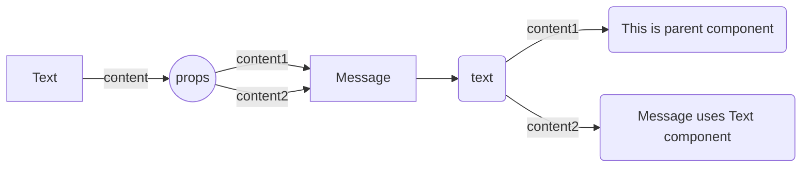

```mermaid
%% Mermaidの試し書き。正確でない %%
flowchart LR
    A[Text] -- content --> B((props))
    B -- content1 --> C[Message]
    B -- content2 --> C
    C --> D("text")
    D --> |content1| E(This is parent component)
    D --> |content2| F(Message uses Text component)
```